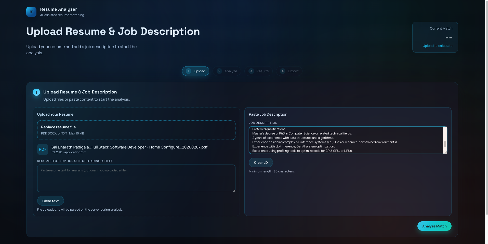
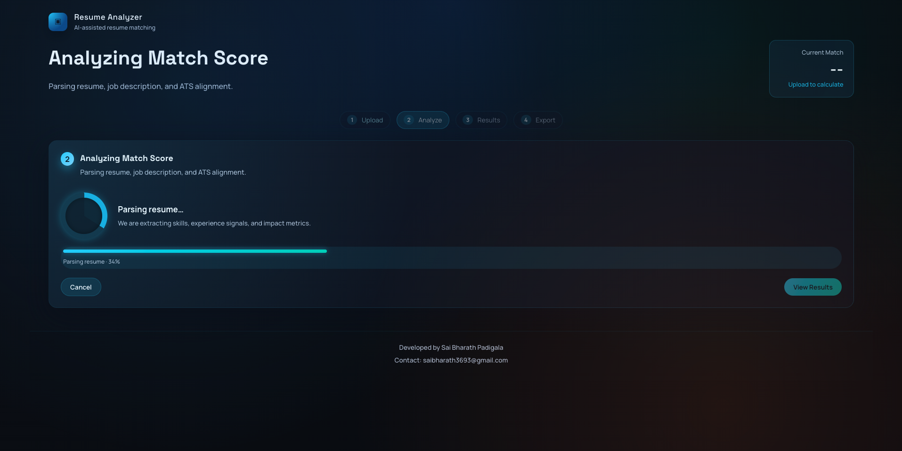
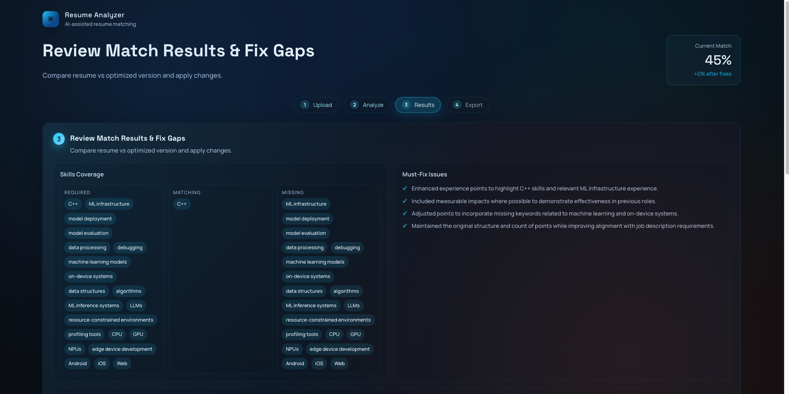
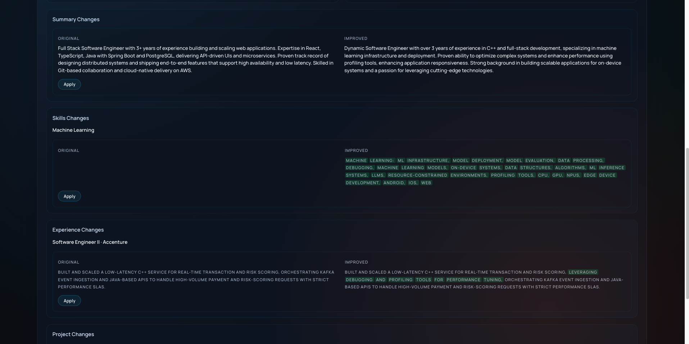
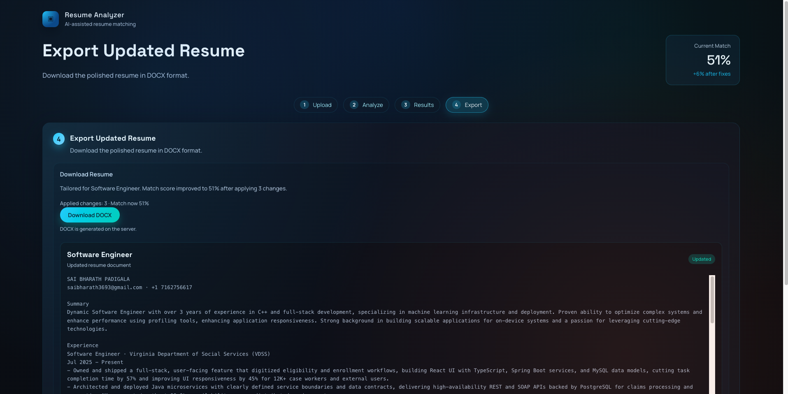

# AI Resume Analyzer

Live app: [AI Resume Analyzer](https://ai-resume-analyzer-rust-pi.vercel.app/)

## Architecture Overview
- **Frontend (Vite + React)**: Single-page app with a 4-step flow (Upload → Analyze → Results → Export). UI compares `resumeJson` vs `analysisJson` and lets users apply changes before export.
- **Backend (Node.js + Express)**: Handles file uploads, resume text extraction, LLM orchestration, scoring, and DOCX export.
- **LLM Pipeline**:
  1. Parse resume → `resumeJson`
  2. Skills optimization → required/matching/missing keywords + updated skills
  3. Experience/project point optimization (in-place edits)
  4. Summary rewrite
  5. Combine into `analysisJson` + compute rule-based match score

## Data Flow (End-to-End)
1. **Upload**: User uploads a file (PDF/DOCX/TXT) or pastes resume text + job description.
2. **Analyze**: Backend extracts text, runs LLM pipeline, returns `resumeJson`, `analysisJson`, and `analysis` (score + keywords).
3. **Results**: Frontend diffs `resumeJson` vs `analysisJson` using stable IDs and applies chosen changes.
4. **Export**: Frontend sends the updated JSON to the backend and downloads the generated DOCX.

## Key Data Contracts
- **`resumeJson`**: Parsed resume with stable IDs for summary, skills, and bullet points.
- **`analysisJson`**: Optimized resume aligned to the job description, preserving IDs for accurate diffs.

## Screenshots

